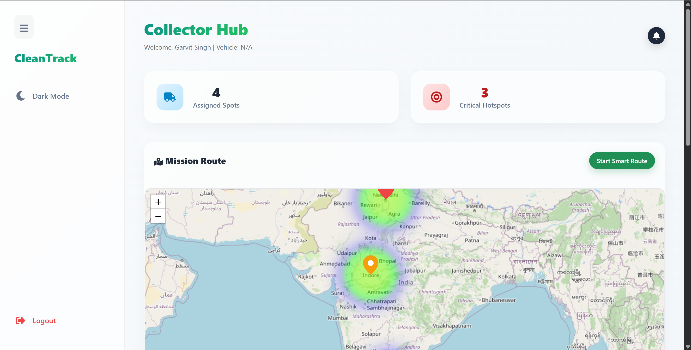

# ♻️ CleanTrack – Smart Waste Management System

An AI-powered smart waste management platform that enables users to report garbage issues, track complaints, and provides administrators with real-time analytics, heatmaps, and actionable insights.

---

## 🚀 Features

### 👤 User Side
* 📍 **Report Garbage Issues**: Pinpoint exact locations using Google Maps.
* 🖼 **Image Uploads**: Attach photos of waste for better identification.
* 🤖 **AI-Based Detection**: Automated analysis of reported issues.
* 📊 **Complaint Tracking**: Real-time status updates on submitted reports.

### 🛡 Admin Dashboard
* 💹 **Real-Time Analytics**: Visual insights with interactive Bar & Line charts.
* 🗺 **Heatmap Visualization**: Identify city-wide waste distribution.
* ⚠ **Hotspot Detection**: Automatic identification of high-density report zones.
* 🔔 **Smart Alerts**: Notifications for new complaints with "Click-to-Highlight" navigation.
* 🔘 **Collector Nudge**: Push collectors for faster resolution without closing cases prematurely.
* ✅ **Proof Review**: Verify "Proof of Work" photos before resolving complaints.
* 📥 **Data Export**: Download all complaint records as CSV.

### 🚛 Waste Collector Dashboard
* 🧳 **Dedicated Interface**: Tailored view for field workers to manage pending tasks.
* 🛣 **Smart Route Optimization**: Automatically calculates the most efficient path for collections.
* 📸 **Proof of Work (POW)**: Mandatory photo submission to confirm cleanup before resolution.
* 🌍 **Live Navigation**: Integrated map for real-time location tracking and guidance.

### 🎨 UI/UX & Notifications
* 🌙 **Dynamic Themes**: Beautiful Dark and Light mode support.
* 🔔 **Multi-Role Alerts**: Specialized notifications for re-opens, approvals, and nudges.
* 📱 **Full Responsiveness**: Seamless experience across Desktop, Tablet, and Mobile.
* ✨ **Modern Aesthetics**: Glassmorphism, smooth animations, and interactive elements.

---

## 🧠 Tech Stack

### Frontend
* **React.js**: Core UI framework.
* **Recharts**: Advanced data visualization for analytics.
* **React Icons**: Modern vector icon set.
* **Vanilla CSS**: Premium, custom-built design system with responsive layouts.

### Backend
* **Node.js & Express.js**: High-performance server-side logic.
* **MongoDB & Mongoose**: Scalable NoSQL database for complaint and user management.
* **Multer**: Secure file and image processing for "Proof of Work".

### Other Tools
* **Google Maps API**: Geographic pinning and navigation.
* **Nodemailer**: Automated status emails and verification codes.

---

## 📊 Screenshots

### Dashboard


### Analytics


### Heatmap


### Collector View


---

## ⚙️ Installation & Setup

### 1️⃣ Clone the repository
```bash
git clone https://github.com/GarvitSingh13/CleanTrack.git
cd CleanTrack
```

### 2️⃣ Setup Backend
```bash
cd backend
npm install
# Create .env file (see below)
npm start
```

### 3️⃣ Setup Frontend
```bash
cd frontend
npm install
npm start
```

### 4️⃣ Environment Variables
Create a `.env` file in the `backend` folder:
```bash
MONGO_URI=your_mongodb_connection_string
JWT_SECRET=your_secret_key
EMAIL_USER=your_email
EMAIL_PASS=your_app_password
```

---

## 📈 Future Improvements
* 🤖 **Advanced AI**: Automated waste classification (Plastic, Organic, etc.).
* 🧾 **Automated Reports**: Weekly PDF insights for city administrators.
* 🎮 **Gamification**: Reward points and badges for top collectors.
* 📱 **Mobile App**: Dedicated Android & iOS versions using React Native.

---

## 👨‍💻 Author
**Garvit Singh**

---

## ⭐ Show your support
If you like this project:
⭐ Star the repository | 🍴 Fork it and improve | 📢 Share it on LinkedIn

