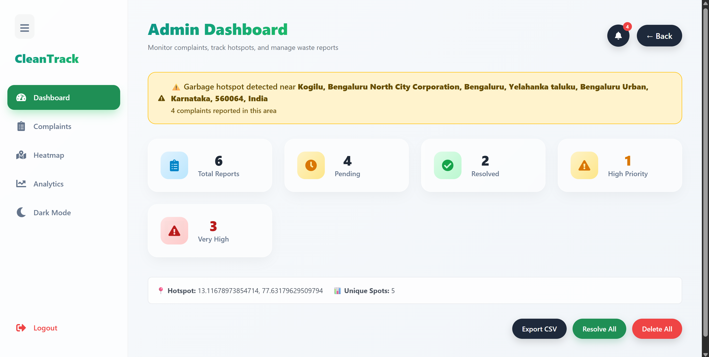
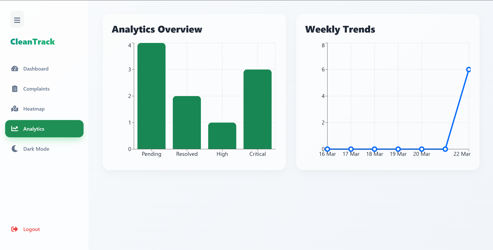
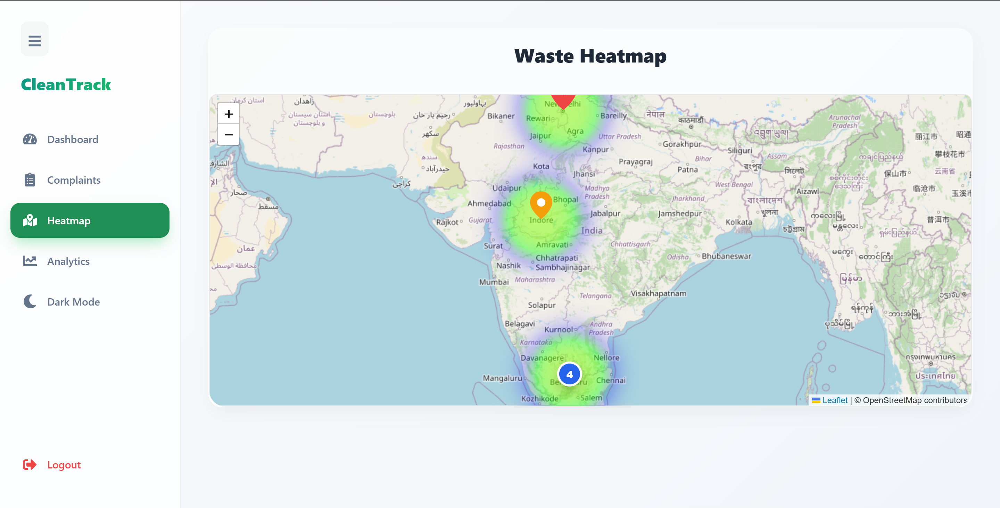
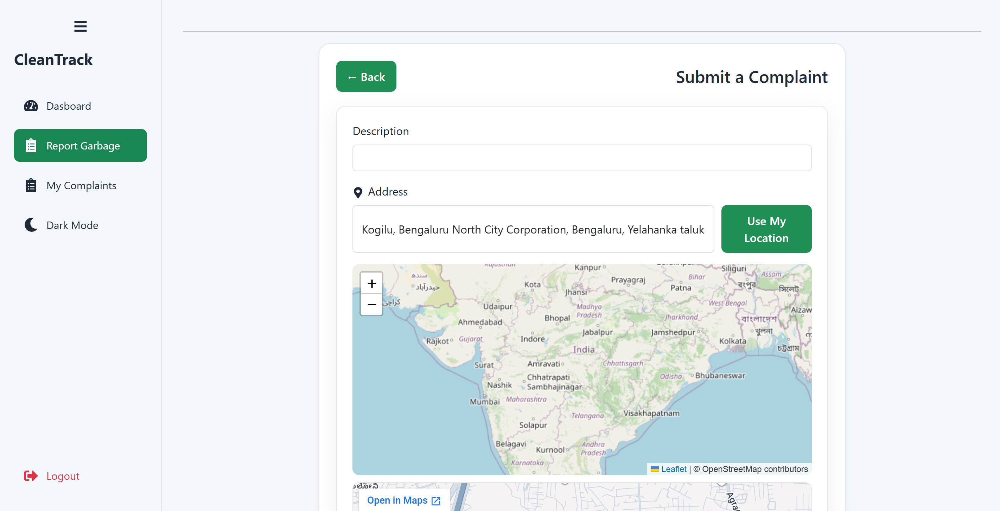

# ♻️ CleanTrack – Smart Waste Management System

An AI-powered smart waste management platform that enables users to report garbage issues, track complaints, and provides administrators with real-time analytics, heatmaps, and actionable insights.

---

## 🚀 Features

### 👤 User Side

* 📍 Report garbage issues with location (Google Maps integration)
* 🖼 Upload images of waste
* 🤖 AI-based garbage detection
* 📊 View complaint status
* 🔐 Secure login system

### 🛠 Admin Dashboard

* 📊 Analytics dashboard (Bar & Line charts)
* 🗺 Heatmap visualization of complaints
* ⚠ Garbage hotspot detection
* ✅ Mark complaints as resolved/unresolved
* 🔥 Priority management (High/Normal)
* 📥 Export complaints as CSV
* 🔄 Real-time complaint updates

### 🎨 UI/UX

* 🌙 Dark / Light mode
* 📂 Collapsible sidebar
* ⚡ Smooth animations
* 📱 Responsive design

---

## 🧠 Tech Stack

### Frontend

* React.js
* Recharts (Data Visualization)
* React Icons
* CSS (Custom styling + Dark mode)

### Backend

* Node.js
* Express.js
* MongoDB

### Other Tools

* Google Maps API
* AI-based image/keyword detection

---

## 📊 Screenshots

### Dashboard


### Analytics


### Heatmap


### Report Form



---

## ⚙️ Installation & Setup

### 1️⃣ Clone the repository

```bash
git clone https://github.com/GarvitSingh13/CleanTrack.git
cd CleanTrack
```

---

### 2️⃣ Setup Backend

```bash
cd backend
npm install
npm start
```

---

### 3️⃣ Setup Frontend

```bash
cd frontend
npm install
npm start
```

---

### 4️⃣ Environment Variables

Create a `.env` file in backend:

```bash
MONGO_URI=your_mongodb_connection_string
JWT_SECRET=your_secret_key
```

---

## 📈 Future Improvements

* 📱 Mobile app version
* 🔔 Push notifications for complaints
* 🤖 Advanced AI waste classification
* 📍 Smart route optimization for garbage collection
* 🧾 Admin reports & insights dashboard

---

## 👨‍💻 Author

**Garvit Singh**

---

## ⭐ Show your support

If you like this project:

⭐ Star the repository
📢 Share it on LinkedIn
🍴 Fork it and improve

---
